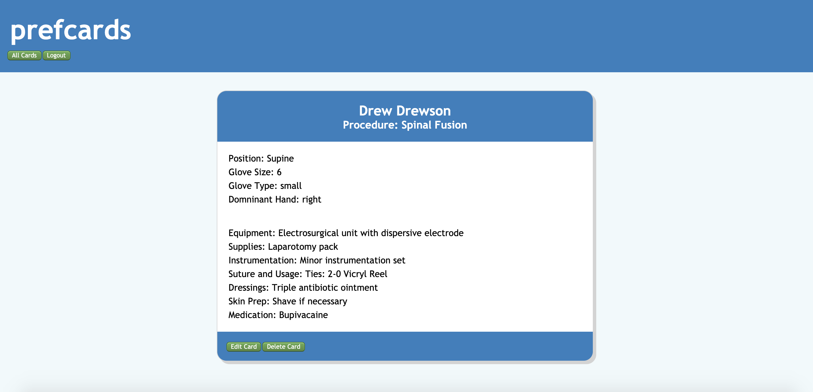
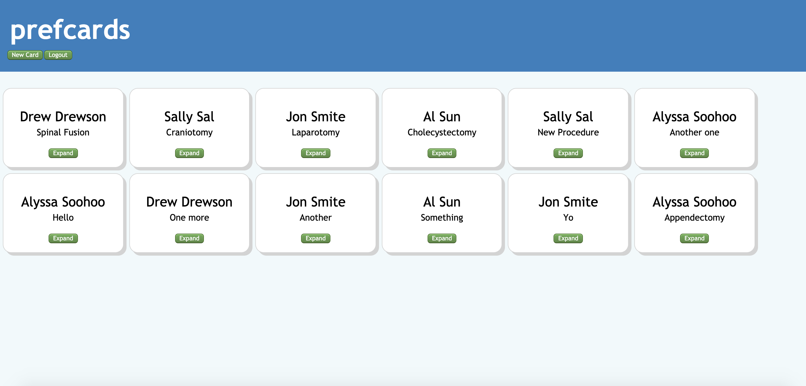

### prefcards

### Link to app
https://andrews-prefcard-app.now.sh/

### Summary
Prefcards helps surgical teams maintain consistent and accurate surgical preference cards.  Preference cards play an integral role in the lead up to any surgery; they help the team properly prepare equipment, supplies, medications, etc. based on the preferences of the surgeon on the case. A number of hospitals use outdated systems for tracking and updating preference cards, leading to inconsistencies from one case to the next and creating problems when new staff members join the team. Prefcards' strength is in its simplicity. View, create and edit preference cards easily through an intutive interface. 

### An individual prefcard

### List of prefcards

### Technology used
Front end: React. React Context API for global state management.
Back end: node.js, Express.js, Postgresql

### API Documentation
https://stark-retreat-17766.herokuapp.com/api

/all
This endpoint will return all prefcards in the database.

/:id
Enter the card id number as a parameter to the URL and get back that specific card.

auth/users
This endpoint will return all users in the database.

auth/users/:id
Like above, the id number for a user is entered as a parameter ot the URL to return that specific user.

